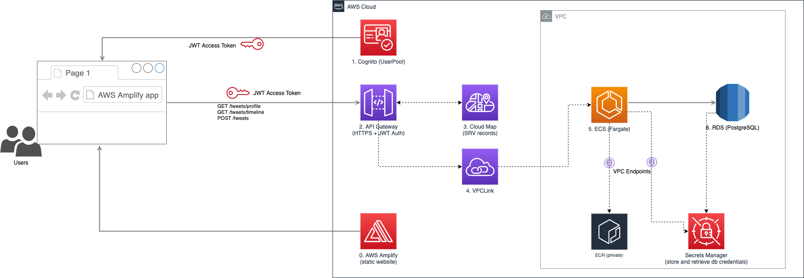

# twitter-clone
This repo is intended as a coding exercise to showcase how to build an end-to-end, easily deployable application on Amazon Web Services.
It is structured into two submodules, namely `twitter-clone-backend` and `twitter-clone-frontend` that, as their naming suggest, cater for the frontend and the backend respectively.

Each submodule has its own `README` that cover the peculiarities of that portion of the codebase.

The app is currently deployed to https://main.d18r50m4aqbc2g.amplifyapp.com
## Architecture
